# Silent Shift OS — Enterprise UEBA Database Design
## Part 1: Complete Schema & ER Model

---

## Design Philosophy

This throws away the flat CSV model entirely. The new schema is
**event-sourced**: everything the system knows is derived from an
append-only `events` table, replayed and aggregated into baselines,
anomalies, threat scores, and alerts. Nothing is mutated in place except
current-state lookup tables (who's on what team right now) — history is
never overwritten, only appended to, so every past state is
reconstructable for an investigator.

Twelve layers, each independently scalable:

| # | Layer | Answers |
|---|---|---|
| 1 | Identity | Who is this person, right now and historically? |
| 2 | Org Context | What project/team are they part of, and since when? |
| 3 | Device | What hardware are they using, and is it trusted? |
| 4 | Network | Where are they connecting from? |
| 5 | Resource | What sensitive things exist to protect? |
| 6 | Permission | Who's ALLOWED to touch what (RBAC + ABAC)? |
| 7 | Event | What actually happened (the raw feed)? |
| 8 | Session | What happened in one continuous login window? |
| 9 | Behavioral Baseline | What's normal for this person? |
| 10 | Sequence Correlation | What multi-step patterns look like an attack? |
| 11 | Anomaly / Threat Score / Alert | How suspicious, and how confident? |
| 12 | Investigation / Audit | How does a human resolve and record it? |

---

## Complete Mermaid ER Diagram

```mermaid
erDiagram
    %% ═══════════ IDENTITY LAYER ═══════════
    DEPARTMENTS ||--o{ EMPLOYEES : "houses"
    EMPLOYEES ||--o{ EMPLOYEES : "reports_to"
    EMPLOYEES ||--o{ TEAM_MEMBERS : "belongs_to"
    TEAMS ||--o{ TEAM_MEMBERS : "has"
    EMPLOYEES ||--o{ EMPLOYEE_ROLE_HISTORY : "has_held"
    ROLES ||--o{ EMPLOYEE_ROLE_HISTORY : "assigned_via"
    EMPLOYEES ||--o{ EMPLOYMENT_STATUS_HISTORY : "has_had"
    EMPLOYEES ||--|| AUTH_IDENTITIES : "authenticates_as"
    AUTH_IDENTITIES ||--o{ MFA_STATUS : "secured_by"

    %% ═══════════ ORG CONTEXT LAYER ═══════════
    PROJECTS ||--o{ PROJECT_MEMBERS : "staffed_by"
    EMPLOYEES ||--o{ PROJECT_MEMBERS : "assigned_to"
    DEPARTMENTS ||--o{ PROJECTS : "owns"

    %% ═══════════ DEVICE LAYER ═══════════
    EMPLOYEES ||--o{ DEVICES : "uses"
    DEVICES ||--o{ DEVICE_TRUST_HISTORY : "trust_tracked_in"
    DEVICES ||--o{ DEVICE_HEALTH_SNAPSHOTS : "monitored_via"

    %% ═══════════ NETWORK LAYER ═══════════
    EMPLOYEES ||--o{ NETWORK_SESSIONS : "connects_via"
    NETWORK_SESSIONS }o--|| IP_ADDRESSES : "originates_from"
    NETWORK_SESSIONS ||--o{ IMPOSSIBLE_TRAVEL_FLAGS : "may_trigger"

    %% ═══════════ RESOURCE LAYER ═══════════
    DEPARTMENTS ||--o{ RESOURCES : "owns"
    PROJECTS ||--o{ RESOURCES : "owns"
    RESOURCES ||--o{ RESOURCE_TAGS : "tagged_with"
    EMPLOYEES ||--o{ RESOURCES : "is_owner_of"

    %% ═══════════ PERMISSION LAYER ═══════════
    ROLES ||--o{ ROLE_PERMISSIONS : "grants"
    PERMISSIONS ||--o{ ROLE_PERMISSIONS : "granted_via"
    EMPLOYEES ||--o{ RESOURCE_PERMISSIONS : "granted_on_resource"
    RESOURCES ||--o{ RESOURCE_PERMISSIONS : "governed_by"
    EMPLOYEES ||--o{ TEMPORARY_PERMISSIONS : "granted_JIT"
    RESOURCES ||--o{ TEMPORARY_PERMISSIONS : "temporarily_opened_via"
    RESOURCE_PERMISSIONS ||--o{ PERMISSION_AUDIT_LOG : "changes_logged_in"

    %% ═══════════ EVENT LAYER (core) ═══════════
    EMPLOYEES ||--o{ EVENTS : "performs"
    DEVICES ||--o{ EVENTS : "originates_from"
    NETWORK_SESSIONS ||--o{ EVENTS : "occurs_within"
    RESOURCES ||--o{ EVENTS : "targets"
    SESSIONS ||--o{ EVENTS : "grouped_under"

    %% ═══════════ SESSION LAYER ═══════════
    EMPLOYEES ||--o{ SESSIONS : "opens"
    DEVICES ||--o{ SESSIONS : "used_in"
    NETWORK_SESSIONS ||--o{ SESSIONS : "carried_over"

    %% ═══════════ BEHAVIORAL BASELINE LAYER ═══════════
    EMPLOYEES ||--o{ BEHAVIORAL_BASELINES : "profiled_in"
    BEHAVIORAL_BASELINES ||--o{ BASELINE_SNAPSHOTS : "versioned_as"

    %% ═══════════ SEQUENCE CORRELATION LAYER ═══════════
    EVENT_SEQUENCES ||--o{ SEQUENCE_EVENTS : "composed_of"
    EVENTS ||--o{ SEQUENCE_EVENTS : "participates_in"
    EMPLOYEES ||--o{ EVENT_SEQUENCES : "flagged_for"

    %% ═══════════ ANOMALY / THREAT / ALERT LAYER ═══════════
    EVENTS ||--o{ ANOMALIES : "triggers"
    EVENT_SEQUENCES ||--o{ ANOMALIES : "triggers"
    EMPLOYEES ||--o{ ANOMALIES : "attributed_to"
    EMPLOYEES ||--o{ THREAT_SCORES : "scored_over_time"
    ANOMALIES ||--o{ ALERT_ANOMALIES : "rolled_into"
    ALERTS ||--o{ ALERT_ANOMALIES : "aggregates"
    ALERTS ||--o{ ALERT_EVIDENCE : "supported_by"
    EMPLOYEES ||--o{ ALERTS : "assigned_analyst"

    %% ═══════════ INVESTIGATION / AUDIT LAYER ═══════════
    ALERTS ||--o| INVESTIGATIONS : "escalates_to"
    EMPLOYEES ||--o{ INVESTIGATIONS : "investigated_by"
    INVESTIGATIONS ||--o{ INVESTIGATION_EVIDENCE : "documents"
    INVESTIGATIONS ||--o{ INVESTIGATION_COMMENTS : "discussed_in"
    INVESTIGATIONS ||--o{ INVESTIGATION_TIMELINE : "chronicled_in"
    EMPLOYEES ||--o{ AUDIT_LOG : "acted_by"

    %% ═══════════ ENTITY DEFINITIONS ═══════════

    DEPARTMENTS {
        uuid department_id PK
        string name
        uuid head_employee_id FK
        timestamptz created_at
    }

    EMPLOYEES {
        uuid employee_id PK
        string full_name
        string email UK
        uuid department_id FK
        uuid manager_id FK "self-reference"
        string employment_type "employee|contractor"
        timestamptz hire_date
        timestamptz created_at
        timestamptz updated_at
    }

    TEAMS {
        uuid team_id PK
        string name
        uuid department_id FK
    }

    TEAM_MEMBERS {
        uuid team_member_id PK
        uuid team_id FK
        uuid employee_id FK
        timestamptz joined_at
        timestamptz left_at "nullable"
    }

    ROLES {
        uuid role_id PK
        string role_name UK
        string description
    }

    EMPLOYEE_ROLE_HISTORY {
        uuid role_history_id PK
        uuid employee_id FK
        uuid role_id FK
        timestamptz effective_from
        timestamptz effective_to "nullable = current"
        string change_reason
        uuid changed_by_employee_id FK
    }

    EMPLOYMENT_STATUS_HISTORY {
        uuid status_history_id PK
        uuid employee_id FK
        string status "active|suspended|terminated|leave"
        timestamptz effective_from
        timestamptz effective_to "nullable"
    }

    AUTH_IDENTITIES {
        uuid identity_id PK
        uuid employee_id FK
        string sso_subject UK
        string auth_provider "okta|google|azure_ad"
        timestamptz created_at
    }

    MFA_STATUS {
        uuid mfa_id PK
        uuid identity_id FK
        boolean enrolled
        string method "totp|push|hardware_key"
        timestamptz last_verified_at
    }

    PROJECTS {
        uuid project_id PK
        string name
        uuid owning_department_id FK
        string sensitivity_level
        timestamptz start_date
        timestamptz end_date "nullable"
    }

    PROJECT_MEMBERS {
        uuid project_member_id PK
        uuid project_id FK
        uuid employee_id FK
        boolean is_temporary
        timestamptz assigned_from
        timestamptz assigned_to "nullable"
    }

    DEVICES {
        uuid device_id PK
        uuid employee_id FK
        string device_type "laptop|mobile|tablet"
        string ownership "company|personal"
        string fingerprint_hash UK
        string os
        string browser
        string hostname
        boolean is_trusted
        timestamptz first_seen_at
        timestamptz last_seen_at
    }

    DEVICE_TRUST_HISTORY {
        uuid trust_history_id PK
        uuid device_id FK
        int trust_score "0-100"
        string reason
        timestamptz recorded_at
    }

    DEVICE_HEALTH_SNAPSHOTS {
        uuid health_id PK
        uuid device_id FK
        boolean antivirus_enabled
        boolean disk_encrypted
        boolean os_up_to_date
        timestamptz captured_at
    }

    IP_ADDRESSES {
        uuid ip_id PK
        string ip_address UK
        string country
        string city
        string asn
        string network_type "office|home|vpn|public_wifi"
    }

    NETWORK_SESSIONS {
        uuid network_session_id PK
        uuid employee_id FK
        uuid ip_id FK
        string connection_type "vpn|direct"
        timestamptz connected_at
        timestamptz disconnected_at "nullable"
    }

    IMPOSSIBLE_TRAVEL_FLAGS {
        uuid travel_flag_id PK
        uuid network_session_id FK
        uuid prior_network_session_id FK
        float distance_km
        float implied_speed_kmh
        timestamptz flagged_at
    }

    RESOURCES {
        uuid resource_id PK
        string resource_type "file|git_repo|database|api|dashboard|doc|cloud_object"
        string name
        uuid owning_department_id FK
        uuid owning_project_id FK "nullable"
        uuid owner_employee_id FK
        string sensitivity "public|internal|confidential|restricted"
        timestamptz created_at
    }

    RESOURCE_TAGS {
        uuid tag_id PK
        uuid resource_id FK
        string tag
    }

    PERMISSIONS {
        uuid permission_id PK
        string permission_name UK
        string description
    }

    ROLE_PERMISSIONS {
        uuid role_permission_id PK
        uuid role_id FK
        uuid permission_id FK
    }

    RESOURCE_PERMISSIONS {
        uuid resource_permission_id PK
        uuid resource_id FK
        uuid employee_id FK
        string access_level "read|write|admin"
        timestamptz granted_at
        timestamptz revoked_at "nullable"
        uuid granted_by_employee_id FK
    }

    TEMPORARY_PERMISSIONS {
        uuid temp_permission_id PK
        uuid resource_id FK
        uuid employee_id FK
        string access_level
        timestamptz expires_at
        string justification
        boolean is_jit "just-in-time grant"
    }

    PERMISSION_AUDIT_LOG {
        uuid audit_id PK
        uuid resource_permission_id FK
        string action "granted|revoked|expired|escalated"
        uuid performed_by_employee_id FK
        timestamptz occurred_at
    }

    EVENTS {
        uuid event_id PK
        string event_type "login|file_read|git_push|usb_insert|..."
        uuid actor_employee_id FK
        uuid target_resource_id FK "nullable"
        uuid device_id FK
        uuid network_session_id FK
        uuid session_id FK
        string source_system "github|gdrive|slack|vpn|email|internal_dashboard"
        jsonb metadata
        uuid trace_id
        timestamptz occurred_at
    }

    SESSIONS {
        uuid session_id PK
        uuid employee_id FK
        uuid device_id FK
        uuid network_session_id FK
        timestamptz login_at
        timestamptz logout_at "nullable"
        boolean mfa_success
        int session_risk_score
    }

    BEHAVIORAL_BASELINES {
        uuid baseline_id PK
        uuid employee_id FK
        string metric_type "login_hour|device_affinity|resource_affinity|download_volume|..."
        jsonb distribution "histogram / stats blob"
        string window "7d|30d|lifetime"
        timestamptz computed_at
    }

    BASELINE_SNAPSHOTS {
        uuid snapshot_id PK
        uuid baseline_id FK
        jsonb snapshot_data
        timestamptz snapshot_at
    }

    EVENT_SEQUENCES {
        uuid sequence_id PK
        uuid employee_id FK
        string pattern_name "e.g. payroll_download_then_usb"
        string mitre_technique "e.g. T1052.001"
        float confidence
        timestamptz window_start
        timestamptz window_end
    }

    SEQUENCE_EVENTS {
        uuid sequence_event_id PK
        uuid sequence_id FK
        uuid event_id FK
        int step_order
    }

    ANOMALIES {
        uuid anomaly_id PK
        uuid event_id FK "nullable"
        uuid sequence_id FK "nullable"
        uuid employee_id FK
        string anomaly_type "rbac_violation|statistical_drift|impossible_travel|..."
        string severity "low|medium|high|critical"
        float confidence
        string explanation
        string trigger_rule
        float statistical_score
        float context_score
        string status "open|acknowledged|dismissed|escalated"
        timestamptz detected_at
    }

    THREAT_SCORES {
        uuid threat_score_id PK
        uuid employee_id FK
        int overall_risk "0-100"
        int identity_risk
        int device_risk
        int network_risk
        int resource_risk
        float behavioral_drift
        float historical_decay_factor
        float final_confidence
        timestamptz computed_at
    }

    ALERTS {
        uuid alert_id PK
        uuid employee_id FK
        string title
        string status "open|investigating|resolved|false_positive"
        uuid assigned_analyst_id FK
        timestamptz sla_due_at
        string resolution_notes
        timestamptz opened_at
        timestamptz closed_at "nullable"
    }

    ALERT_ANOMALIES {
        uuid alert_anomaly_id PK
        uuid alert_id FK
        uuid anomaly_id FK
    }

    ALERT_EVIDENCE {
        uuid evidence_id PK
        uuid alert_id FK
        string evidence_type "event_ref|log_excerpt|screenshot|note"
        jsonb payload
        timestamptz added_at
    }

    INVESTIGATIONS {
        uuid investigation_id PK
        uuid alert_id FK
        uuid investigator_employee_id FK
        string root_cause
        string resolution
        string status "open|closed"
        uuid linked_incident_id "nullable"
        timestamptz opened_at
        timestamptz closed_at "nullable"
    }

    INVESTIGATION_EVIDENCE {
        uuid evidence_id PK
        uuid investigation_id FK
        string evidence_type
        jsonb payload
        timestamptz added_at
    }

    INVESTIGATION_COMMENTS {
        uuid comment_id PK
        uuid investigation_id FK
        uuid author_employee_id FK
        string comment_text
        timestamptz posted_at
    }

    INVESTIGATION_TIMELINE {
        uuid timeline_id PK
        uuid investigation_id FK
        string action_taken
        uuid performed_by_employee_id FK
        timestamptz occurred_at
    }

    AUDIT_LOG {
        uuid audit_log_id PK
        string entity_type "permission|role|project|admin_action|investigation"
        uuid entity_id
        string action
        jsonb before_state
        jsonb after_state
        uuid performed_by_employee_id FK
        timestamptz occurred_at
    }
```

---

## Table-by-Table Reference

### 1. Identity Layer

| Table | Purpose | Key relationships |
|---|---|---|
| `departments` | Org units | Self-contained; referenced everywhere |
| `employees` | Core identity record | Self-referencing `manager_id` for reporting hierarchy |
| `teams` / `team_members` | Sub-department groupings | Many-to-many via join table, with `left_at` for history |
| `roles` | Named job functions ("Accountant", "DevOps Engineer") | Referenced by `employee_role_history`, `role_permissions` |
| `employee_role_history` | **Append-only.** Every role an employee has ever held | This IS your Context Resolver's data source — `effective_to IS NULL` means current |
| `employment_status_history` | Active/suspended/terminated over time | Lets the engine instantly de-risk a terminated employee's historical events without deleting them |
| `auth_identities` / `mfa_status` | SSO identity + MFA enrollment | Feeds `session_risk_score` |

**Why `employee_role_history` instead of a `current_role` column on `employees`:** the entire Context Resolver depends on knowing what role someone held *on a specific past date*. A mutable column destroys that. This table is append-only — a promotion is a new row, never an update.

### 2. Org Context Layer

| Table | Purpose |
|---|---|
| `projects` | Named initiatives, each owned by a department, each with a sensitivity level |
| `project_members` | Who's staffed on what, with `is_temporary` flag and date bounds — this is what makes a contractor's 2-week embed look different from a permanent transfer |

### 3. Device Layer

| Table | Purpose |
|---|---|
| `devices` | Every device seen, company or personal, with a `fingerprint_hash` for re-identification |
| `device_trust_history` | Trust score over time — a device isn't binary trusted/untrusted, it decays and recovers |
| `device_health_snapshots` | Point-in-time compliance checks (AV on? disk encrypted?) — a compromised device shows up here before it shows up as an anomaly |

### 4. Network Context Layer

| Table | Purpose |
|---|---|
| `ip_addresses` | Deduplicated IP → geo/ASN lookup |
| `network_sessions` | A connection window — VPN or direct, from a given IP |
| `impossible_travel_flags` | Computed when two sessions imply physically impossible movement speed |

### 5. Resource Layer

| Table | Purpose |
|---|---|
| `resources` | Every protectable thing — polymorphic via `resource_type`, always has a sensitivity level and an owner |
| `resource_tags` | Free-form tagging for flexible grouping ("PII", "financial", "prod-secrets") |

### 6. Permission Layer (RBAC + ABAC hybrid)

| Table | Purpose |
|---|---|
| `permissions` / `role_permissions` | **RBAC** — coarse, role-level grants |
| `resource_permissions` | **ABAC** — fine-grained, per-employee, per-resource overrides |
| `temporary_permissions` | Time-bound and JIT grants — expire automatically, no manual revocation needed |
| `permission_audit_log` | Every grant/revoke/expiry, immutable |

This is the direct evolution of your existing `access_control_matrix.csv` — RBAC still exists (role → permission), but now layered with resource-specific overrides and expiring grants, which a flat CSV matrix can't represent.

### 7. Event Layer (the core feed)

`events` is the single most important table in the schema — **append-only, high-volume, partitioned by day in production** (see Part 2). Every single thing anyone does anywhere becomes one row here: `actor_employee_id`, `target_resource_id`, `device_id`, `network_session_id`, `source_system`, a flexible `metadata` JSONB blob for event-type-specific fields, and a `trace_id` for correlating across systems.

Everything downstream — baselines, anomalies, sequences, threat scores — is computed *from* this table. Nothing else is a primary source of truth.

### 8. Session Layer

Groups events into one continuous login window. `session_risk_score` is a denormalized rollup (computed by the scoring engine, cached here for fast dashboard reads) so the UI doesn't have to re-aggregate every event on every page load.

### 9. Behavioral Baseline Layer

| Table | Purpose |
|---|---|
| `behavioral_baselines` | One row per employee per metric type per window (7d/30d/lifetime) — a JSONB distribution blob (histogram, mean/std, whatever the metric needs) |
| `baseline_snapshots` | Versioned history of the baseline itself, so you can see how "normal" drifted over time |

### 10. Sequence Correlation Layer

| Table | Purpose |
|---|---|
| `event_sequences` | A detected multi-step pattern (e.g., "VPN connect → git clone → mass download") with a MITRE ATT&CK technique ID attached |
| `sequence_events` | The ordered join table linking specific events to their position in the sequence |

### 11. Anomaly / Threat Score / Alert Layer

| Table | Purpose |
|---|---|
| `anomalies` | One row per individual suspicious signal — could stem from a single event or a whole sequence |
| `threat_scores` | **Versioned history**, not a single mutable number — every computation is a new row, so you can chart risk drift over time per employee |
| `alerts` | Aggregates multiple anomalies into one actionable SOC ticket |
| `alert_anomalies` / `alert_evidence` | Join table + supporting evidence blobs |

### 12. Investigation / Audit Layer

| Table | Purpose |
|---|---|
| `investigations` | One per escalated alert, owned by an analyst |
| `investigation_evidence` / `investigation_comments` / `investigation_timeline` | The full case file |
| `audit_log` | Generic, immutable, catches every permission/role/project/admin/investigation change across the whole system |

---

## Cardinality Summary

| Relationship | Cardinality | Why |
|---|---|---|
| Department → Employees | 1:N | One department, many employees |
| Employee → Employee (manager) | 1:N self-ref | A manager has many reports; each employee has one manager |
| Employee → Role History | 1:N | Every promotion/transfer is a new row, never overwritten |
| Employee ↔ Projects | M:N via `project_members` | Employees can be on multiple projects; projects have multiple staff |
| Employee → Devices | 1:N | One person, multiple devices (laptop + phone) |
| Employee → Sessions | 1:N | Many login sessions over time |
| Session → Events | 1:N | Many actions within one login window |
| Resource ↔ Employees (permissions) | M:N via `resource_permissions` | Fine-grained ABAC — any employee can have any access level on any resource |
| Event → Anomalies | 1:N | One weird action can trigger multiple distinct anomaly types |
| Anomalies ↔ Alerts | M:N via `alert_anomalies` | Multiple related anomalies get bundled into one alert for an analyst to review together |
| Alert → Investigation | 1:0..1 | Not every alert gets escalated to a full investigation |

---

## What this fixes vs. the CSV version

| Old (CSV-based) | New (schema-based) |
|---|---|
| `role_change_events.csv` — one flat row per promotion | `employee_role_history` — full append-only history, queryable "what was X's role on date Y" |
| `access_control_matrix.csv` — role → resource only | RBAC (`role_permissions`) + ABAC (`resource_permissions`) + JIT (`temporary_permissions`) — three tiers of permission granularity |
| `access_logs.csv` — one flat table, no device/network context | `events` table with device, network session, and full JSONB metadata per event |
| No session concept | Explicit `sessions` table grouping events, with its own risk score |
| No multi-step attack detection | `event_sequences` + MITRE ATT&CK mapping |
| Flat threat_score column, overwritten each run | Versioned `threat_scores` history — chart risk drift over time |
| No investigation workflow | Full `investigations` → evidence → comments → timeline chain |

---

## Next up (Part 2)

Once you've reviewed this, the next installment is the actual runnable
PostgreSQL DDL — `CREATE TABLE` statements with proper types, indexes
(including the partitioning strategy for `events` by day), constraints,
and cascade rules — so you can spin this up in a real database and
start writing the ingestion pipeline against it.
