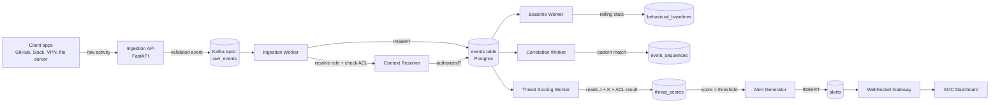

# Silent Shift OS — Real-Time Architecture
## Part 3: Event Pipeline, Engines, Dashboard Flow

---

## The pipeline, end to end

Nothing in this pipeline is synchronous end-to-end. The only synchronous
part is Ingestion API → Kafka → `events` row existing — everything after
that (baselines, correlation, scoring, alerting) runs asynchronously so a
slow scoring computation never blocks the next event from being ingested.

---

## Stage by stage

### 1. Ingestion API (FastAPI)

Every source system (GitHub, Slack, VPN gateway, file server) posts to
one endpoint: `POST /v1/events`. The API's only jobs are:

- Validate the payload shape (event_type is known, actor_employee_id
  resolves to a real employee)
- Stamp a `trace_id` if the source didn't provide one
- Publish to the `raw_events` Kafka topic, partitioned by
  `actor_employee_id` — this guarantees Kafka preserves per-employee
  event ordering, which matters enormously for sequence detection later
- Return `202 Accepted` immediately — the caller doesn't wait for
  scoring to finish

The API never writes to Postgres directly. Decoupling ingestion from
storage means a burst of activity (everyone logging in at 9am) doesn't
create write contention on the database — Kafka absorbs the burst,
workers drain it at their own pace.

### 2. Ingestion Worker + Context Resolver

Consumes `raw_events`, and for each message:

1. Inserts the row into `events` (the append-only fact)
2. Resolves the actor's **effective role right now** — a lookup against
   `current_employee_roles` (the materialized view from Part 2), not a
   raw table scan
3. Checks `role_permissions` / `resource_permissions` /
   `temporary_permissions` for that (role, resource) pair
4. If unauthorized, immediately writes an `anomalies` row with
   `anomaly_type = 'rbac_violation'` — this one check doesn't need to
   wait for the baseline/scoring workers, because "is this even allowed"
   is a yes/no fact, not a statistical judgment

**Idempotency**: every Kafka message carries the `event_id` generated at
the API layer. The worker does `INSERT ... ON CONFLICT (event_id,
occurred_at) DO NOTHING` — so if a worker crashes mid-batch and Kafka
redelivers the message, the retry is a harmless no-op, not a duplicate
row.

### 3. Baseline Worker

Runs on two triggers: a **rolling schedule** (every 15 minutes, recompute
any baseline whose window has aged out) and **on-demand** (a specific
employee's baseline gets recomputed immediately after an anomaly fires
for them, so the next event judges them against fresh statistics, not
stale ones from before the incident started).

Reads recent `events` rows for one employee, computes mean/std for each
`metric_type` (`login_hour`, `download_volume`, `device_affinity`, …),
and **inserts** a new `behavioral_baselines` row — old baselines aren't
overwritten, they age out naturally when a query asks for the latest one
per `(employee_id, metric_type, window)`. A `baseline_snapshots` row is
written alongside it, so "how did this person's normal drift over the
last quarter" is a queryable timeline, not a single frozen number.

**Concept drift guard**: if an employee is mid-investigation (an open
`anomalies` row references them), the baseline worker skips recomputing
their baseline from the suspicious period — otherwise the attacker's own
malicious behavior would slowly get absorbed into their "normal,"
which defeats the entire point of the system.

### 4. Correlation Worker

Runs continuously against a **sliding time window** per employee (e.g.,
last 72 hours), pattern-matching sequences of `event_type` values
against a small library of known attack shapes (VPN connect → git clone
→ mass download; failed logins → successful login → privilege
escalation). On a match, it writes one `event_sequences` row and the
matched events into `sequence_events`, tagged with a MITRE ATT&CK
technique ID.

This worker is the one most tolerant of latency — a sequence spanning 72
hours doesn't need sub-second detection, so it runs on a coarser
schedule (every few minutes) rather than per-event.

### 5. Threat Scoring Worker

Triggered whenever a new `anomalies` row appears (RBAC violation,
statistical drift, or sequence match). Pulls together:

- The anomaly's own severity/confidence
- The employee's current `device_risk` (from `device_trust_history`)
- `network_risk` (any `impossible_travel_flags` recently?)
- `historical_decay_factor` — older anomalies count for less, so a
  clean record since a past incident gradually restores someone's score
  rather than permanently flagging them

Writes one new `threat_scores` row — versioned, never updated in place,
exactly like `employee_role_history`.

### 6. Alert Generator

Watches for `threat_scores.overall_risk` crossing the configured
threshold. When it does, it either opens a **new** `alerts` row or, if
an open alert already exists for that employee, attaches the new
`anomalies` row to the existing one via `alert_anomalies` — this is
what stops one person's continued suspicious activity from spawning
twenty separate alerts instead of one alert that keeps accumulating
evidence.

### 7. WebSocket Gateway → Dashboard

The gateway subscribes to a lightweight Postgres `LISTEN/NOTIFY` channel
that the Alert Generator and Threat Scoring Worker both publish to on
every insert. Connected dashboard clients get pushed the update
directly — no polling, no the-dashboard-refetches-everything-every-5-
seconds pattern. The dashboard only re-queries Postgres directly when a
user opens a specific employee's full history (not on every score tick).

---

## Ordering, retries, and idempotency — the three things that break naive versions of this

| Concern | How it's handled |
|---|---|
| **Event ordering** | Kafka partition key = `actor_employee_id`, so all of one person's events land on the same partition and are consumed in order. Cross-employee ordering doesn't matter for this system. |
| **Worker crash mid-batch** | Every insert is keyed on a value generated upstream (`event_id`, or a natural key like `(employee_id, metric_type, window)` for baselines) with `ON CONFLICT DO NOTHING` / `DO UPDATE`, so replaying a Kafka message twice is safe. |
| **Out-of-order delivery across systems** | `occurred_at` comes from the source system, not the ingestion timestamp — a VPN log delivered late still gets correctly time-sorted for sequence detection, it just means the correlation worker's window has to tolerate a small delivery-lag buffer (5-10 minutes) before considering a window "closed." |
| **Duplicate anomaly spam** | The Threat Scoring Worker checks for an existing open alert before creating a new one — accumulate evidence, don't fragment it. |

---

## Prototype: proving the design actually runs

Below is a working (not pseudocode) implementation of the ingestion →
context resolution → scoring → alert chain, run against the real Part 2
schema in a live Postgres instance. This collapses the async workers
into sequential function calls for demonstration — in production they're
separate processes reading from Kafka, but the *logic* inside each one
is exactly what's shown here.
